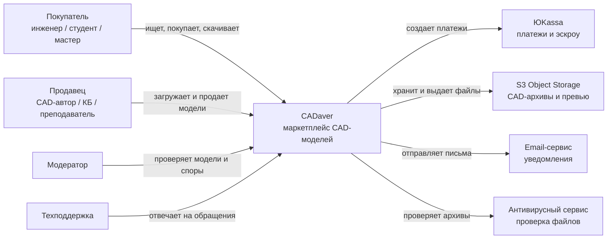
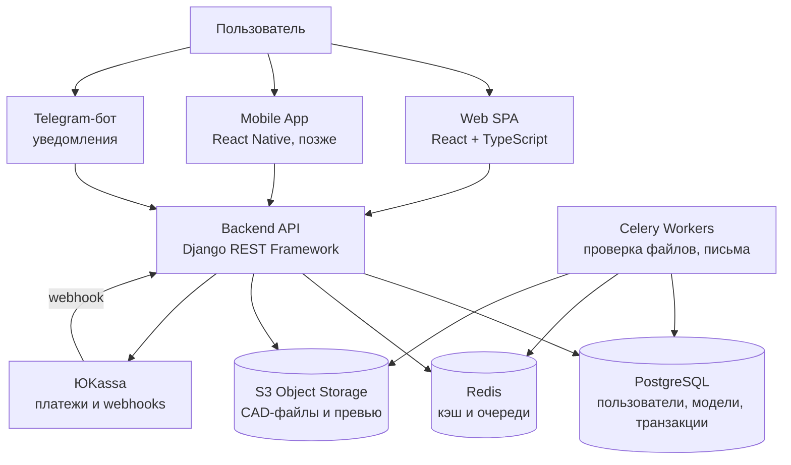

# CADaver

> **Кладбище CAD-моделей**  
> *Где старые чертежи обретают новую жизнь.*

---

## Практическое задание №1

### Elevator Pitch

Инженеры и проектировщики тратят до 40% рабочего времени на повторное моделирование стандартных узлов, деталей и сборок, которые уже были созданы кем-то ранее. **CADaver** - это специализированная библиотека-маркетплейс CAD-моделей, где проверенные мастера безопасно продают, покупают и обменивают готовые параметрические модели. На старте платформа фокусируется на популярных форматах SolidWorks и КОМПАС-3D, а дальше расширяется на другие САПР.

CADaver превращает «мертвый груз» накопленных чертежей в ликвидный актив, сокращая время вывода новых продуктов на рынок с недель до часов.

### Lean Canvas

| Блок | Содержание |
|:---|:---|
| **1. Проблема** | Инженеры тратят часы и дни на моделирование типовых элементов, которые уже есть в архивах других специалистов.<br><br>Накопленные CAD-библиотеки компаний и фрилансеров лежат «мертвым грузом» на жестких дисках и не монетизируются.<br><br>Существующие площадки часто бесплатны, универсальны и не гарантируют качество параметрических моделей.<br><br>Нет доверия и безопасных сделок при продаже интеллектуальной собственности между частными лицами. |
| **2. Целевая аудитория** | **Первичная:** инженеры-конструкторы и CAD-фрилансеры с опытом 3+ лет; малые КБ и hardware-стартапы без штатного отдела моделирования.<br><br>**Вторичная:** промышленные предприятия с архивами моделей; учебные заведения; самозанятые мастера в 3D-печати, оснастке и прототипировании. |
| **3. Уникальное ценностное предложение** | CADaver делает накопленные CAD-архивы живыми и ликвидными. Это площадка, где можно продавать готовые параметрические модели почти так же просто, как размещать товар на маркетплейсе, но с защитой сделки, проверкой файлов и инженерной репутацией автора. |
| **4. Решение** | Каталог моделей с ценой от продавца.<br><br>Автоматическая проверка файлов: вирусы, целостность архива, наличие исходника САПР и STEP.<br><br>Эскроу-сделка: деньги замораживаются до подтверждения покупки или окончания периода претензий.<br><br>Рейтинг авторов, отзывы, ручная модерация первых моделей.<br><br>В перспективе - API и плагины для загрузки моделей прямо из САПР. |
| **5. Каналы привлечения** | Профессиональные Telegram-чаты и форумы инженеров-конструкторов.<br><br>SEO под запросы «готовая модель [деталь] [САПР]».<br><br>Партнерства с учебными центрами по САПР.<br><br>Прямые продажи малым КБ и hardware-стартапам.<br><br>Публикации и реклама в профильных медиа: isicad.ru, sapr-journal.ru. |
| **6. Ключевые метрики** | Количество активных авторов.<br><br>Количество платных скачиваний в месяц.<br><br>Средний чек и комиссия платформы.<br><br>Конверсия из просмотра карточки в покупку.<br><br>Процент повторных покупок.<br><br>Среднее время модерации модели. |
| **7. Скрытое преимущество** | Глубокая экспертиза в CAD-процессах и понимание боли инженеров.<br><br>Связи с профессиональными сообществами, преподавателями и техническими блогерами.<br><br>Стартовое портфолио из 50+ качественных параметрических моделей для наполнения каталога. |
| **8. Структура затрат** | Разработка и поддержка платформы.<br><br>Хостинг, база данных, объектное хранилище CAD-файлов.<br><br>Разработка модуля проверки моделей.<br><br>Юридическое сопровождение: лицензии, права, пользовательские соглашения.<br><br>Маркетинг, платежные комиссии, поддержка и модерация. |
| **9. Источники дохода** | Комиссия с продажи: 15-25% от суммы сделки.<br><br>Платное продвижение моделей в каталоге.<br><br>Корпоративные подписки для КБ.<br><br>White Label-библиотеки для крупных предприятий.<br><br>Партнерские программы с дистрибьюторами САПР. |

---

## Практическое задание №2

### Роли

- **Покупатель** - инженер, студент, мастер 3D-печати или сотрудник КБ.
- **Продавец** - автор модели: фрилансер, КБ, преподаватель, CAD-специалист.
- **Модератор** - проверяет качество моделей и соблюдение правил.
- **Техподдержка** - решает проблемы с оплатой, скачиванием и спорами.
- **Админ** - управляет пользователями, настройками платформы и аналитикой.

### User Stories

1. Как пользователь, я хочу зарегистрироваться или войти в аккаунт, чтобы покупать и продавать модели.
2. Как покупатель, я хочу найти модель по ключевым словам, чтобы быстро перейти к нужной детали.
3. Как покупатель, я хочу фильтровать модели по САПР-формату, цене, категории и рейтингу автора.
4. Как покупатель, я хочу открыть карточку модели с 3D-превью, описанием, отзывами и списком файлов.
5. Как покупатель, я хочу добавить модель в корзину, чтобы оформить покупку позже.
6. Как покупатель, я хочу оплатить модель через эскроу, чтобы сделка была безопасной.
7. Как покупатель, я хочу скачать модель после успешной оплаты.
8. Как покупатель, я хочу оценить модель и оставить отзыв о продавце.
9. Как покупатель, я хочу открыть спор, если модель не соответствует описанию.
10. Как покупатель, я хочу оформить подписку Pro, чтобы скачивать больше моделей по абонементу.
11. Как пользователь, я хочу пополнить внутренний кошелек, чтобы быстрее оплачивать покупки.
12. Как пользователь, я хочу обратиться в техподдержку через чат.
13. Как продавец, я хочу пройти верификацию, чтобы получить право продавать модели.
14. Как продавец, я хочу загрузить модель с названием, описанием, ценой, файлами и превью.
15. Как продавец, я хочу получить автоматическую проверку модели на вирусы и целостность.
16. Как продавец, я хочу пройти ручную модерацию первых моделей, чтобы повысить доверие покупателей.
17. Как продавец, я хочу редактировать карточку модели.
18. Как продавец, я хочу получать уведомления о продажах.
19. Как продавец, я хочу вывести заработанные деньги на свой счет.
20. Как продавец, я хочу ответить на отзыв покупателя.
21. Как продавец, я хочу участвовать в арбитраже при споре.
22. Как модератор, я хочу видеть очередь моделей на проверку.
23. Как модератор, я хочу одобрять или отклонять модель с указанием причины.
24. Как админ, я хочу блокировать нарушителей.
25. Как админ, я хочу вмешиваться в спорные сделки.
26. Как админ, я хочу отправлять массовые уведомления.
27. Как админ, я хочу видеть дашборд с ключевыми метриками.

### Приоритизация функционала: RICE + MoSCoW

Оценка: Reach, Impact, Confidence, Effort - от 1 до 3.
Score = (Reach × Impact × Confidence) / Effort.

| ID | User Story | R | I | C | E | Score | MoSCoW |
|:---|:---|:---:|:---:|:---:|:---:|:---:|:---|
| 1 | Регистрация / вход | 3 | 3 | 3 | 2 | 13.5 | Must |
| 2 | Поиск по ключевым словам | 3 | 3 | 3 | 2 | 13.5 | Must |
| 3 | Фильтрация по формату и цене | 3 | 2 | 3 | 1 | 18.0 | Must |
| 4 | Карточка модели с 3D-превью | 3 | 2 | 2 | 2 | 6.0 | Should |
| 5 | Корзина | 3 | 1 | 3 | 1 | 9.0 | Should |
| 6 | Оплата через эскроу | 3 | 3 | 3 | 3 | 9.0 | Must |
| 7 | Скачивание после оплаты | 3 | 3 | 3 | 1 | 27.0 | Must |
| 8 | Оценка и отзыв | 3 | 2 | 2 | 2 | 6.0 | Should |
| 9 | Открытие спора | 2 | 2 | 2 | 2 | 4.0 | Could |
| 10 | Подписка Pro | 1 | 2 | 2 | 3 | 1.3 | Won't for MVP |
| 14 | Загрузка модели продавцом | 2 | 3 | 3 | 2 | 9.0 | Must |
| 15 | Автопроверка модели | 2 | 2 | 2 | 2 | 4.0 | Should |
| 16 | Ручная модерация первых 5 моделей | 2 | 2 | 3 | 2 | 6.0 | Should |
| 19 | Вывод денег продавцом | 2 | 3 | 2 | 3 | 4.0 | Could |

### MVP и MLP

#### MVP - Minimum Viable Product

- Регистрация и вход.
- Поиск по ключевым словам.
- Базовая фильтрация по формату и цене.
- Карточка модели без сложного интерактивного 3D-превью.
- Оплата через эскроу через один платежный шлюз.
- Скачивание модели после успешной оплаты.
- Загрузка модели продавцом.
- Автоматическая проверка архива на вирусы и целостность.
- Ручная модерация первых 5 моделей продавца.

**Результат MVP:** рабочая C2C-площадка с безопасной сделкой, базовым каталогом и минимальным доверием к качеству файлов.

#### MLP - Minimum Lovable Product

- Интерактивное 3D-превью в карточке.
- Корзина.
- Оценки и отзывы.
- Открытие спора.
- Подписка Pro.
- Вывод денег продавцам.
- Чат с поддержкой.
- Модераторский арбитраж.
- Уведомления в Telegram.

**Результат MLP:** платформа, которой пользователи доверяют и к которой хочется возвращаться.

### Детализация требований

#### История 6: оплата модели через эскроу

**Функциональные требования:**

- Система должна создавать транзакцию при нажатии покупателем кнопки «Купить».
- Система должна проверять, что покупатель авторизован, модель опубликована и одобрена модератором.
- Система должна передавать в платежный шлюз сумму, валюту, ID покупателя, ID модели и callback URL.
- После успешного платежа транзакция получает статус `paid_awaiting_download`.
- Деньги должны удерживаться на стороне эскроу до подтверждения покупателем или истечения 7 дней.
- При ошибке оплаты система должна показать понятное сообщение и оставить модель доступной для повторной покупки.

**Нефункциональные требования:**

- Время создания платежа - не более 3 секунд при нормальной нагрузке.
- Все платежные запросы должны передаваться только по HTTPS.
- Система не должна хранить полные данные банковских карт.
- Все статусы платежей должны логироваться для аудита.
- Доступность платежного сценария в MVP - не ниже 99% в рабочее время.

#### История 7: скачивание модели после оплаты

**Функциональные требования:**

- Система должна показывать кнопку «Скачать» только для оплаченных покупок.
- Система должна выдавать временную подписанную ссылку на скачивание.
- Ссылка должна быть привязана к конкретному покупателю и транзакции.
- Если срок ссылки истек, пользователь может запросить новую ссылку из личного кабинета.
- Система должна фиксировать факт скачивания и время скачивания.
- После первого скачивания покупатель может оставить отзыв или открыть спор.

**Нефункциональные требования:**

- Ссылка на файл должна жить не более 30 минут.
- CAD-архивы должны храниться в объектном хранилище, недоступном напрямую без подписи.
- Скачивание файла до 200 МБ должно начинаться не позднее чем через 5 секунд.
- Система должна выдерживать не менее 100 одновременных скачиваний в MVP.
- Все попытки несанкционированного доступа к файлам должны логироваться.

---

## Практическое задание №3

### DDD: доменные зоны

#### 1. Identity & Access

Зона отвечает за регистрацию, вход, роли, права доступа и верификацию продавцов.

**Глоссарий:** пользователь, роль, сессия, продавец, покупатель, верификация, блокировка.

#### 2. Catalog

Зона отвечает за публикацию, поиск, фильтрацию и карточку CAD-модели.

**Глоссарий:** модель, CAD-формат, категория, цена, превью, рейтинг, карточка модели.

#### 3. Content Verification

Зона отвечает за проверку загруженных архивов, антивирус, целостность файлов и ручную модерацию.

**Глоссарий:** архив, исходник САПР, STEP-файл, автопроверка, очередь модерации, причина отклонения.

#### 4. Orders & Escrow

Зона отвечает за покупку, оплату, эскроу, статусы транзакций, скачивание и выплаты.

**Глоссарий:** заказ, транзакция, платеж, эскроу, комиссия, выплата, подписанная ссылка.

#### 5. Support & Disputes

Зона отвечает за отзывы, споры, поддержку, арбитраж и жалобы.

**Глоссарий:** отзыв, спор, арбитраж, претензия, тикет поддержки, решение модератора.

### BDD: критический путь MVP

Критический путь MVP: **покупатель -> поиск модели -> оплата -> скачивание**.

#### Сценарий успеха

**Дано:**

- Покупатель авторизован.
- Модель «Фланец DIN 2633» за 500 ₽ одобрена модератором.
- У покупателя достаточно средств на карте.

**Когда:**

- Покупатель ищет `фланец din`, открывает карточку и нажимает «Купить».
- Система переводит покупателя на оплату.
- Покупатель подтверждает платеж.

**Тогда:**

- Транзакция получает статус `paid_awaiting_download`.
- Покупатель видит кнопку «Скачать» и успешно скачивает архив.
- Через 7 дней или раньше при подтверждении покупателя деньги переводятся продавцу за вычетом комиссии.

#### Сценарий отказа: неуспешная оплата

**Дано:**

- Покупатель авторизован.
- Модель находится в корзине.
- На карте покупателя недостаточно средств.

**Когда:**

- Покупатель вводит данные карты и нажимает «Оплатить».
- Платежный шлюз возвращает ошибку `insufficient_funds`.

**Тогда:**

- Система не создает успешную транзакцию.
- Покупатель видит сообщение: «Ошибка оплаты. Проверьте баланс или выберите другой способ».
- Кнопка «Купить» остается активной, модель остается в корзине.

### Wireframes: ключевые экраны

#### Экран поиска / каталога

```text
+--------------------------------------------------+
| CADaver | Поиск CAD-моделей                       |
+--------------------------------------------------+
| [фланец din                         ] [Искать]   |
+--------------------------------------------------+
| Фильтры: САПР [Все v] Цена [0-1000] Рейтинг [v]  |
+--------------------------------------------------+
| +----------------------------------------------+ |
| | Фланец DIN 2633                              | |
| | SolidWorks | 500 ₽ | рейтинг 4.5             | |
| | [Открыть] [Купить]                           | |
| +----------------------------------------------+ |
| +----------------------------------------------+ |
| | Втулка ISO 123                               | |
| | КОМПАС-3D | 300 ₽ | рейтинг 4.0              | |
| | [Открыть] [Купить]                           | |
| +----------------------------------------------+ |
+--------------------------------------------------+
```

#### Карточка модели

```text
+--------------------------------------------------+
| <- Фланец DIN 2633                         4.5   |
+--------------------------------------------------+
| +----------------------------------------------+ |
| | 3D-превью / изображение модели                | |
| +----------------------------------------------+ |
| Цена: 500 ₽                                      |
| САПР: SolidWorks 2022                            |
| Файлы: SLDPRT, STEP, PDF                         |
| Продавец: @EngineerPro, успешных сделок 98%      |
|                                                  |
| [Купить сейчас]                                  |
+--------------------------------------------------+
```

#### Экран оплаты

```text
+--------------------------------------------------+
| Оформление заказа                                |
+--------------------------------------------------+
| Товар: Фланец DIN 2633                           |
| Сумма: 500 ₽                                     |
| Комиссия включена в стоимость                    |
|                                                  |
| Способ оплаты:                                   |
| ( ) Карта **** 4242                              |
| ( ) Новая карта                                  |
|                                                  |
| [Оплатить 500 ₽]                                 |
+--------------------------------------------------+
```

#### Экран скачивания

```text
+--------------------------------------------------+
| Покупка оплачена                                 |
+--------------------------------------------------+
| Фланец DIN 2633                                  |
| Статус: оплачено, ожидает скачивания             |
| Ссылка активна 30 минут                          |
|                                                  |
| [Скачать архив]                                  |
| [Оставить отзыв] [Открыть спор]                  |
+--------------------------------------------------+
```

### API-First: JSON-контракты

#### 1. Поиск моделей

**GET** `/v1/models/search?q={query}&cad={cad}&min_price={min}&max_price={max}&sort={sort}&limit=20&offset=0`

**Ответ 200 OK:**

```json
{
  "total": 42,
  "items": [
    {
      "id": "mod_123",
      "name": "Фланец DIN 2633 PN16",
      "cad_format": "SolidWorks",
      "price": 500,
      "currency": "RUB",
      "rating": 4.5,
      "seller": {
        "id": "usr_456",
        "nickname": "EngineerPro",
        "rating": 0.98
      }
    }
  ]
}
```

#### 2. Создание транзакции

**POST** `/v1/transactions`

**Запрос:**

```json
{
  "model_id": "mod_123",
  "buyer_id": "usr_789",
  "payment_method": "card",
  "payment_token": "tok_1a2b3c4d"
}
```

**Ответ 200 OK:**

```json
{
  "transaction_id": "tr_9876",
  "status": "paid_awaiting_download",
  "amount": 500,
  "currency": "RUB",
  "download_url": "https://cdn.cadaver.example/secure/mod_123.zip?signature=...",
  "expires_at": "2026-05-07T12:00:00Z"
}
```

**Ошибка 400:**

```json
{
  "error": {
    "code": "insufficient_funds",
    "message": "Недостаточно средств."
  }
}
```

---

## Практическое задание №4

### C4 Model: уровень 1 - контекст



### C4 Model: уровень 2 - контейнеры



### Стек MVP

| Зона | Технология | Обоснование |
|:---|:---|:---|
| Backend | Python 3.12 + Django REST Framework | Быстрая разработка API, ORM, админка, удобная работа с бизнес-логикой. |
| База данных | PostgreSQL | ACID-транзакции, JSON-поля, полнотекстовый поиск, надежность для платежей. |
| Кэш и очереди | Redis | Простая и быстрая основа для кэша, rate limiting и очередей Celery. |
| Хранение файлов | S3: MinIO / Yandex Object Storage | Дешевое масштабируемое хранение больших CAD-архивов и превью. |
| Фоновая обработка | Celery | Асинхронная проверка архивов, отправка писем, обработка тяжелых задач. |
| Frontend | React + TypeScript | Компонентный интерфейс, типизация, удобная разработка каталога и кабинетов. |
| State management | TanStack Query | Кэширование API-запросов, статусы загрузки, повторные запросы. |
| 3D-превью | Three.js + STLLoader | Доступный способ показывать вращаемую 3D-модель в браузере. |
| Платежи | ЮKassa | Поддержка российских платежей, документация, webhooks, сценарии удержания средств. |
| Хостинг | VPS: Yandex Cloud / Timeweb | Недорогой старт, контроль окружения, простое масштабирование MVP. |
| CI/CD | GitHub Actions | Автоматический запуск тестов и деплой. |

---

## Практическое задание №5

### Hiring Plan: команда на MVP

| Роль | Кол-во | Главные зоны ответственности |
|:---|:---:|:---|
| Product Owner / Founder | 1 | Бэклог, интервью с инженерами, приоритизация, ручная модерация на старте, финансы. |
| Backend Developer | 1 | API, платежи, эскроу-логика, загрузка файлов, проверка моделей, БД. |
| Frontend Developer | 1 | React SPA, каталог, карточка модели, сценарий покупки, личный кабинет. |
| QA Engineer | 0.5 | Чек-листы, тестирование платежей, регресс, проверка критического пути. |
| DevOps Engineer | 0.5 | Docker, VPS, CI/CD, бэкапы, мониторинг. |

Дополнительно на 2-3 месяц: маркетолог для привлечения первых авторов и модератор для разгрузки Founder.

### Development Framework

**Выбор:** Scrum с двухнедельными спринтами. Для MVP достаточно 4-6 спринтов.

Почему Scrum подходит:

1. Высокая неопределенность спроса: нужно быстро проверять гипотезы на инженерах и менять приоритеты.
2. Есть риск интеграции платежей и эскроу: короткие итерации позволяют раньше найти технические ограничения.
3. Небольшая команда получает прозрачный ритм: планирование, демо, ретроспективы и регулярная синхронизация.

### Team Rituals

| Ритуал | Цель | Частота |
|:---|:---|:---|
| Daily Standup, 15 минут | Синхронизация, выявление блокеров | Каждый рабочий день |
| Sprint Planning, 1-1.5 часа | Выбор задач на спринт | Раз в 2 недели |
| Backlog Grooming, 30 минут | Уточнение требований и переоценка задач | Раз в неделю |
| Sprint Review, 30-40 минут | Демо готовых функций ранним пользователям | Раз в 2 недели |
| Retrospective, 30 минут | Улучшение процесса разработки | Раз в 2 недели |
| Weekly Risk Check, 15 минут | Проверка ключевых рисков и решений | Раз в неделю |

### Ключевые риски проекта

| Риск | Тип | Уровень | Стратегия реагирования |
|:---|:---|:---|:---|
| Платежный шлюз не поддержит нужный сценарий эскроу | Внешний | Высокий | Проверить сценарий в песочнице до разработки; подготовить запасной вариант через Stripe Connect или ручное удержание выплат на старте. |
| Продажа чужих моделей и нарушение авторских прав | Внутренний | Высокий | Ручная модерация первых 5 моделей каждого продавца; жалобы; блокировки; обязательное подтверждение прав при загрузке. |
| Низкий спрос: инженеры не готовы платить за модели | Внешний | Высокий | Запустить freemium: несколько бесплатных моделей; провести интервью до MVP; показывать калькулятор экономии времени. |
| Проблемы с 3D-превью и тяжелыми файлами | Внутренний | Средний | Конвертировать превью в glTF, кэшировать на CDN, ограничить размер файлов в MVP. |
| Конкуренция с бесплатными библиотеками | Внешний | Средний | Фокус на параметрических настраиваемых моделях, проверке качества, эскроу и эксклюзивных сериях авторов. |
| Регуляторные риски эскроу как финансовой услуги | Внешний | Низкий | Использовать платежного агрегатора с готовыми юридическими схемами; проконсультироваться с юристом перед публичным запуском. |

---

## Итог

CADaver - C2C-маркетплейс CAD-моделей, который помогает инженерам экономить время, а авторам монетизировать накопленные архивы. MVP концентрируется на простом и проверяемом критическом пути: найти модель, оплатить через безопасную сделку и скачать файл.
